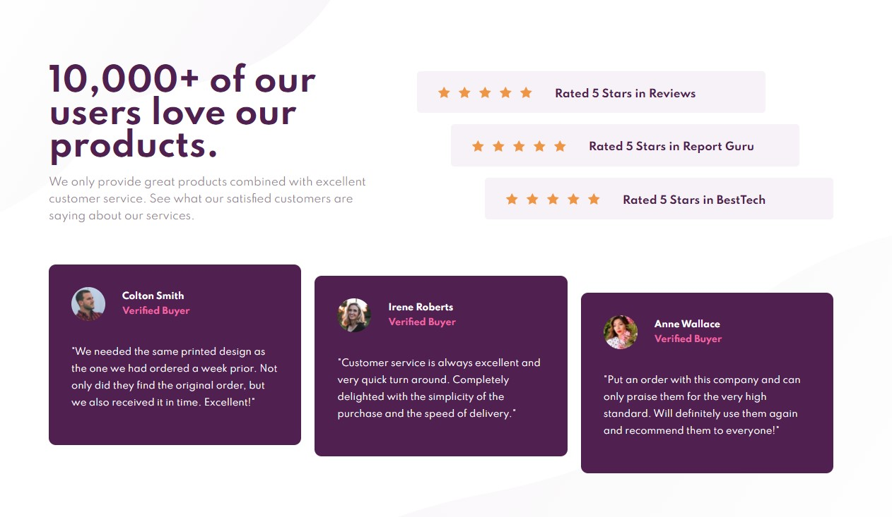

# Frontend Mentor - Social proof section solution

This is a solution to the [Social proof section challenge on Frontend Mentor](https://www.frontendmentor.io/challenges/social-proof-section-6e0qTv_bA). Frontend Mentor challenges help you improve your coding skills by building realistic projects. 

## Table of contents

- [Overview](#overview)
  - [The challenge](#the-challenge)
  - [Screenshot](#screenshot)
  - [Links](#links)
- [My process](#my-process)
  - [Built with](#built-with)
  - [What I learned](#what-i-learned)
  - [Continued development](#continued-development)
- [Author](#author)


## Overview

### The challenge

Users should be able to:

- View the optimal layout for the section depending on their device's screen size

### Screenshot



### Links

- Solution URL: [My solution](https://www.frontendmentor.io/solutions/social-proof-section-html-and-sass-crcwa0Fou)
- Live Site URL: [Github pages](https://timmartin13.github.io/social-proof-section/)

## My process

### Built with

- Semantic HTML5 markup
- CSS custom properties
- Flexbox
- Mobile-first workflow

### What I learned

I learned how to reference the nth-child of various html tags.  There was a lot of flexbox exercise in this challenge also, which was fun.

To see how you can add code snippets, see below:

```css
.rating {
  &:nth-child(1) {
    transform: translateX(-6rem);
  }

  &:nth-child(2) {
    transform: translateX(-3rem);
  }
}
```

### Continued development

I am going to continue to focus on Sass but I want to start putting all of these projects into react.


## Author

- Website - [My portfolio](https://timmartin13.github.io/react-portfolio/)
- Frontend Mentor - [@TimMartin13](https://www.frontendmentor.io/profile/TimMartin13)

